# Machine Learning Development Lifecycle (MLDLC) - Framing the problem
- Gathering data
    - Either from : csv files, APIs, web scraping, database by creating a datawarehouse, spark clusters
- Data pre-processing
    - Remove duplicates
    - Remove missing values
    - Remove outliers
- Exploratory Data Analysis
    - Visualization
    - Univariate analysis
    - Bi-variate analysis
    - Multivariate analysis
    - Outlier detection
    - Handle imbalanec dataset
- Feature engineering and Selection
    - Features are input columns
    - Features engineering means creating new columns to make things easier
    - Features selection means selecting the required columns only
- Model Training, Evaluation, Selection
- Model Deployment
- Testing
- Optimize
  

# Tensor
Tensor is just a data structure. It is a mathematical object that is a generalization for scalars, vectors and matrices.
  
  
# 1. Gathering Data
- csv
- json/sql
- fetch api
- web scraping
  
# 2. Understanding your data
- First <a href="./2-understanding-data/1.ipynb">this notebook</a>, then
- **Univariate analysis**
  - analysing individual cols
  - the data in a col can be either
    - numerical
    - or categorical
  
# 3. Feature Engineering
  1. **Feature transformation**
     - Missing value imputation
       - Scikit learn doesn't accepts missing values so you will have to either fill or remove missing values
     - Handling categorical values
       - Need to convert categorical values into numerical values
     - Outlier Detection
       - Outliers are dangerous to have in the data therefore you need to remove them
       - First need to detect them and then remove
     - Feature Scaling
  2. **Feature construction**
     - Here we create a completely new col
  3. **Feature selection**
     - Only selecting some of the columns from the dataset for training
  4. **Feature extraction**
     - PCA, LDA
   
---

# 1. Feature Transformation
  - ## *1. Feature Scaling*
    Is a technique to standardise the independent features present in the data in a fixed range
    #### Feature scaling can be done in two ways
      - <u>**Standardization**</u> (Z-score normalization)
        - First it subtracts the mean value (so
standardized values have a zero mean), then it divides the result by the
standard deviation (so standardized values have a standard deviation equal
to 1).
      - <u>**Normalization**</u>
        - The goal of normalization is to change the values of numeric columns in the dataset to use a common scale
        - **Min-Max Scaling** is most used normalization technique
          - In this, the values of the column are shifted and rescaled so that they end up ranging from 0 to 1
          - This is performed by subtracting each by the min value and then dividing by the difference between the min and the max
          - $\Huge x_i = \frac{x_i - x_{min}}{x_{max} - x_{min}}$
          
      #### Normalization vs Standardization
      - Most of the time <u>Standardization</u> is only used
      - When you already know the min and max values - use MinMax scaling
      - When you know outliers exist - use Robust scaling  
  - ## *2. Encoding Categorical Data*
    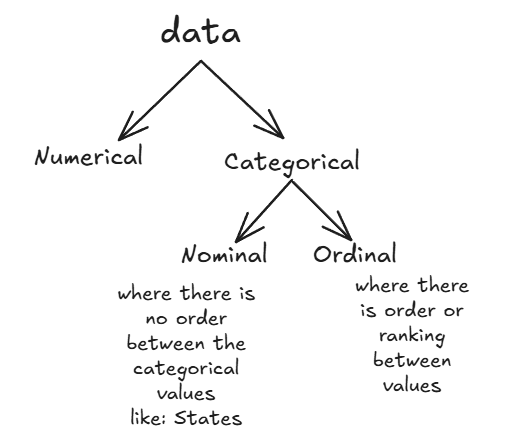  
    - Categorical data are mostly in string, but ml algos expect number
    - ***So we need to convert them into number, this process is called <u>encoding</u>***
    - Two most popular encoding techniques are
      1. **Ordinal encoding** - used to encode ordinal categorical data
           - What you actually do here is assign the categories with a number based on their order like 0, 1, 2... for poor, average, good...  
           - ***Label encoding** - is used to encode ordinal data in the output column. Ordinal encoding is only used to encode ordinal data in the input columns i.e y_train and y_test*
      2. **One hot encoding** - used to encode nominal categorical data
           - What you actually do here is make something like a truth table
           - 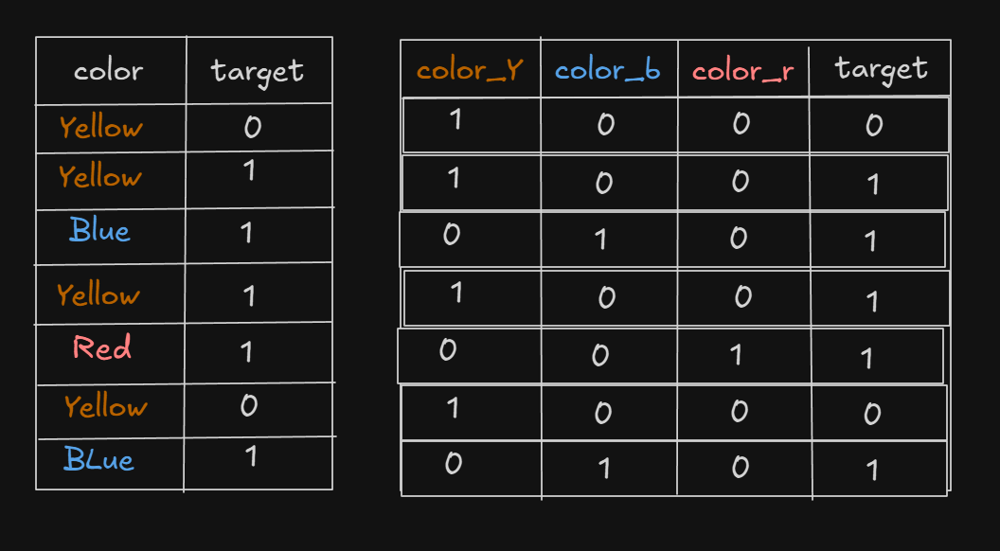
           - **NOTE** : After making the n columns you have to remove one column generally that will be the first column. This is actually done to remove <u>*Multicollinearity*</u> which means there is a mathematical relationship between the input columns also called independent columns ( output columns are called dependent columns because they depend on input columns ). So thus the input columns should be independent of each other. When doing one hot encoding and creating the truth table like thing you see every input column is mathematically related as the some of values of every row is 1.  Therefore to remove <u>*Multicollinearity*</u> we remove any column ( first column in general ).  
          - If you have 50 categories then YES you will have to make 50 columns. But sometimes if you have a situation where you have some categories occuring much more than others then you can combine the least frequent categories to make a new column called Others. This way you can reduce the number of columns being created.
            
     - ## ***Pipelines in Scikit learn***
          - If you don't use pipelines then the series of steps that you will perform (for transformation) during traning the model should be repeated again in the production code i.e input prediction code
    
  - ## *3. Mathematical Transformation*
    - In simple terms transforming the column values by applying some mathematical formulas
    - The end goal of these transformation is to convert the data into normal distribution i.e to normally distribute the data
    - **How to find whether the data is normally distributed or not?**
      - seaborn kdeplot
      - pandas skew function
      - QQ plot
    - **Types of mathematical transformer**
      1. **Function Transformer**
         - <u>Log transform</u>
           - Takes log of every value of the col
           - ***Where to use Log transform?***
             - **Right skewed data** : When data is right skewed. It will tend to bring it to center
             - 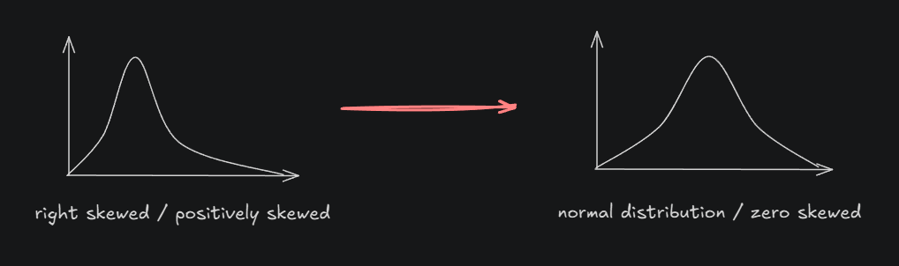
         - <u>Reciprocal tranform</u>
         - <u>Square transform</u>
           - **Left skewed data** : Specially used to transform left skewed data
         - <u>Square root transform</u>
      2. **Power Transformer**
         - Box-cox transform
         - Yeo-Johnson transform
      3. **Quantile Transformer**
        

  - ## *4. Encoding Numerical Data*
    - **Techniques to encode numerical data**
      1. **<u>Dicretization / Binning</u>**
           - Discretization is the process of transforming continuous variables into dicrete variables by creating a set of contiguous intervals that span the range of the variable's values.
           - Also called binning where bin is an alternative name for interval
           - **Types of discretization**
             1. Unsupervised binning
                 - Equal width binning / Uniform binning
                 - Equal frequency binning / Quantile binning
                 - K Means binning
             2. Supervised binning
                 - Decision tree binning
             3. Custom binning
      2. **<u>Binarization</u>**
           - The process of transforming continuous variables into binary values
     
  - ## *5. Handling mixed variables*
    - Consider if you are having a column that has both numerical and categorical
    - Then you will have to create two seperate tables - one for numerical data and other for categorical data.
    - So in a particular row if the actual value was numerical so now in both the new tables the numerical column will have the value and categorical values will be null.
    - Opposite, if the actual value is categorical  
    - **Two possible ways you can get mixed variable values in a column**
    - 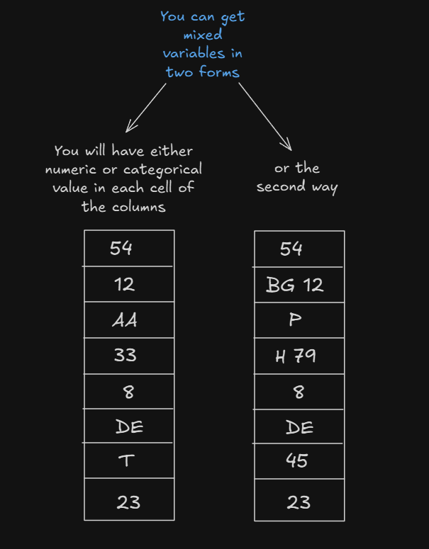
     
  - ## *6. Handling Mssing Data*
    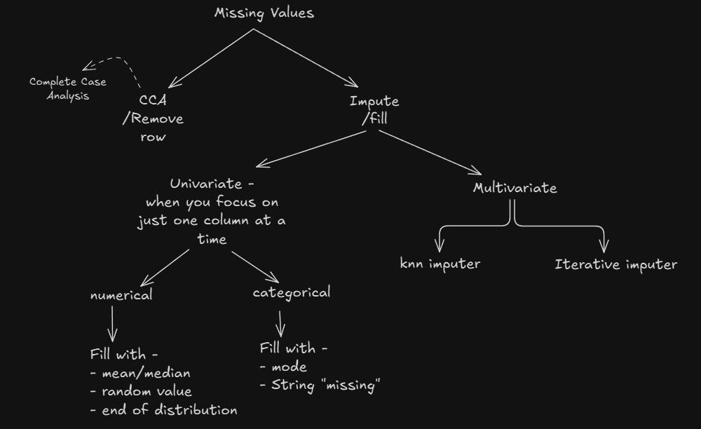
     

    ### Complete Case Analysis / List-wise deletion (removing rows)
    - Assumption for CCA
    - MCAR - Missing Completely At Random
      - You only apply CCA when you are sure that the values are missing randomly i.e in random rows
    - **When to use CCA**
      - MCAR
      - less than 5% missing values
    

    ### Handling Missing Numerical Data
    1. **Univariate Imputation** 
    If to fill a missing value in a column you use statistical techniques on the other values of the <u>same</u> column
         - <u>*Mean/Median Imputation*</u>
           - when data is MCAR (missing completely at random)
         - <u>*Arbritary Value Imputation*</u>
           - when not randomly
           - add some arbitary values like 99 or -1 in place of null
           - this is used to just specify that here is a null value
         - <u>*End of distribution*</u>
           - Extension of Arbitary value imputation
           - Imputer with the value at the end of the distribution
           - **If the distribution is**
             - **Normally distributed**
               - use (mean + 3σ) or (mean - 3σ)
             - **Skewed distribution**
               - use IQR proximity rule : q
         - <u>*Random Sample Imputation*</u>
    1. **Multivariate Imputation** 
    If you are using statistical techniques on other columns also to fill the data in one column
      

    ### Handling Missing Categorical Data
    1. **Most frequent value imputation** 
    Most frequent value is called <u>*mode*</u>
        - **This is used when -**
          - MCAR (missing completely at random)
        - **Downside -**
          - Changes the shape of the distribution
    1. **Create new category with the name of "missing"**
        - **Used when -**
          - Not missing at random
          - And there are lot of missing values
      

    ### Random Imputator
    In this we select random numbers from the column itself and fill the missing values
        
  - ## *7. Outlier Detection*
    - **How to treat outliers** 
      After detecting the outliers do either of two- 
      1. **Trimming**
         - Remove all the outlier values
         - Just remove the rows with greater than upper limit values and lesser than lower limit value
      2. **Capping**
         - Replace all the outlier values with the limit values
         - Values greater than upper limit are replaced with the upper limit
         - Values lesser than lower limit are replaced with the lower limit
    - **How to detect outliers?**
      1. **If normally distributed data**
       - 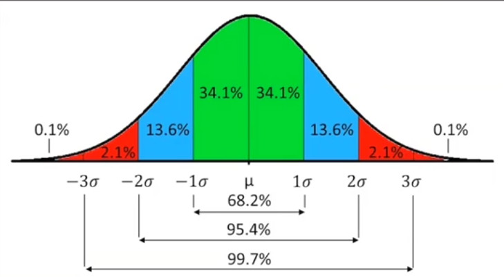
       - then if the observation
         - is > ( μ + 3σ )&nbsp; or
         - is < ( μ - 3σ ) &nbsp; &nbsp; (here μ = mean and σ = standard deviation) 
       then the observation is said to be an outlier
      2. **If skewed data**
        - 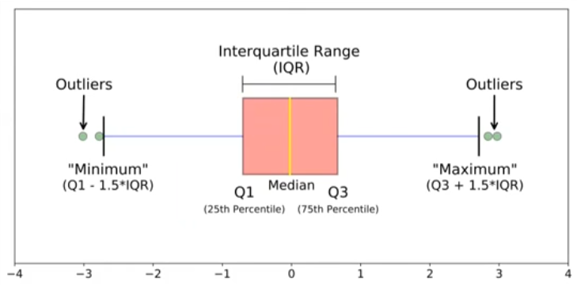
      3. **Other distribution**
        - 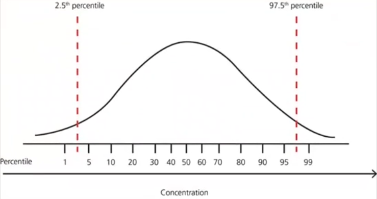 
    - ### **Techniques for outlier detection and removal**
      ### <u>*1. Z-score treatment*</u>
         - $\huge z score, Z = \frac{x - \mu}{\sigma}$
      ### <u>*2. IQR based filtering*</u>
         - On skewed data
         - 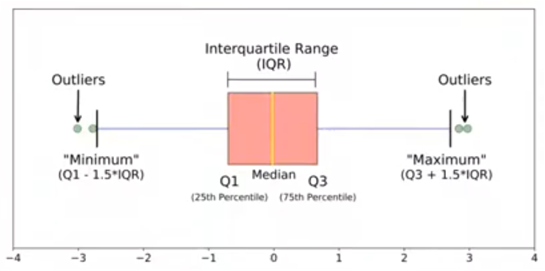  
         - 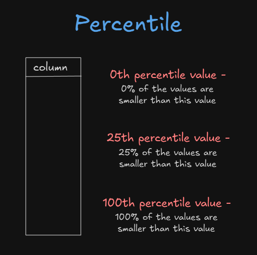  
         - $\large IQR = 75 percentile - 25 percentile$
      ### <u>*3. Percentile Method*</u>
        - In this you decide a threshold value for e.g 1
        - Threshold 1 means values smaller than 1 percentile and values greater than 99% percentile are considered outlier
        - Threshold 5 would mean considering 5 and 95 percentile values as limits
        - **After that you do either of two :**
          - Remove the outliers
          - Capping(called Winsorization in case of percentile method)
            - Replace all the outlier values with the limit values.
      ### <u>*4. Winsorization*</u>
        
---
> ## Dimensionality reduction techniques 
> - Feature Selection and
> - Feature Extraction

 

# 2. Feature Extraction
Feature Extraction techinques -  
**1. PCA (Principle Complete Analysis)**
  - Used to convert a higher dimensional dataset into a lower dimensional dataset
  - **Benifits :**
    - Faster execution of algorithms due to lesser features
    - Visualization
   

# ML Algos
## 1. Linear Regression 
- Is a supervised machine learning algorithm
- *The main goal is to find a straight line(in case of 2 dimensions) and hyperplane(in case of more than 2 dimensions) that best fits the data*
- i.e finding an equation $y = mx + b$
  - that predicts the package( $y$ ) from cgpa( $x$ )
- **The goal is to find the best value of m and b that minimizes the error between predicted and actual value**
- 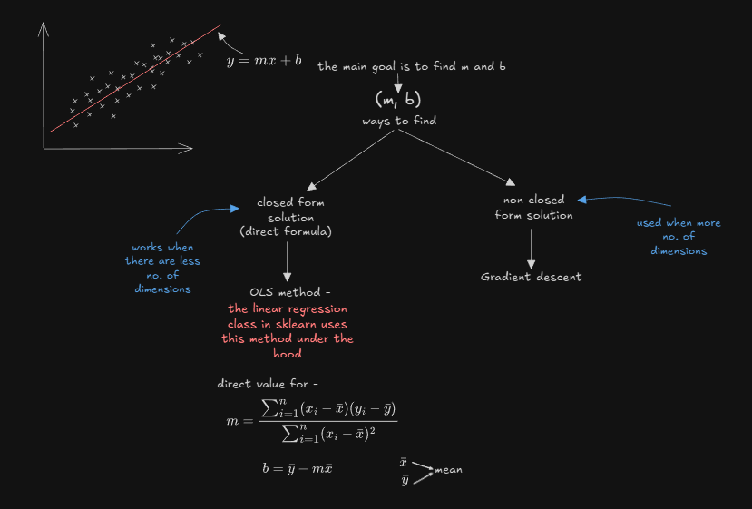
 
 
- **Types -**
  1. Simple linear regression
  2. Multiple linear regression
  3. Polynomial linear regression
- **Regression Metrics -** 
  these are used to find the efficiency of the regression applied on the dataset
  - > loss/error functions : these tell about the errors -
  - MAE
  - MSE
  - RMSE
  - > these tell how good the model is -
  - R2 score
    - 
  - Adjusted R2 score
  ### 1. MAE (Mean Absolute Error)
  - 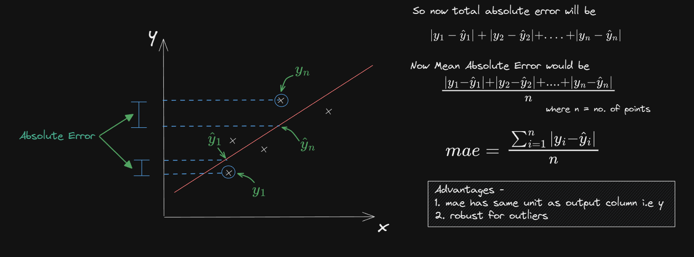
  ### 2. MSE (Mean Squared Error)
  - This is one is usually the default consideration  
  - 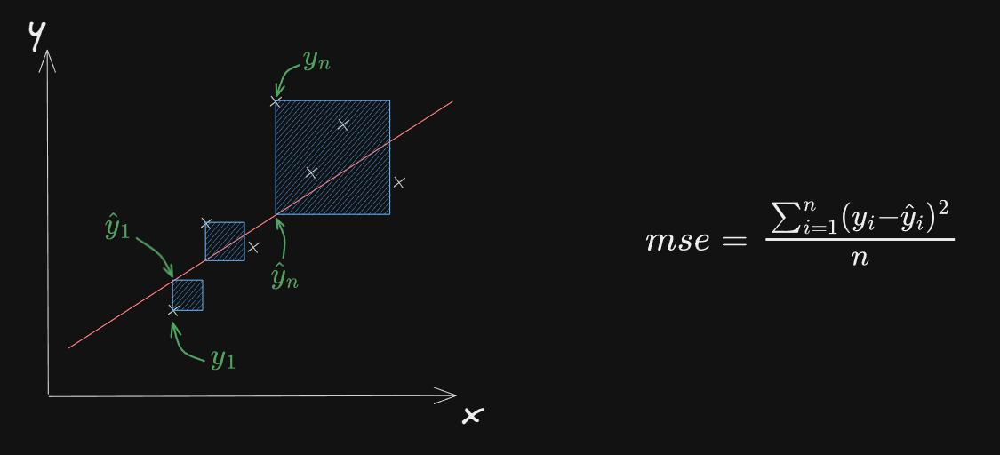
  ### 3. RMSE (Root Mean Squared Error)
  - 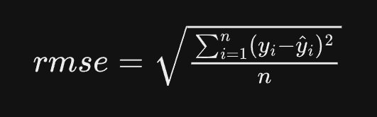
  ### 4. R2 Score
  - 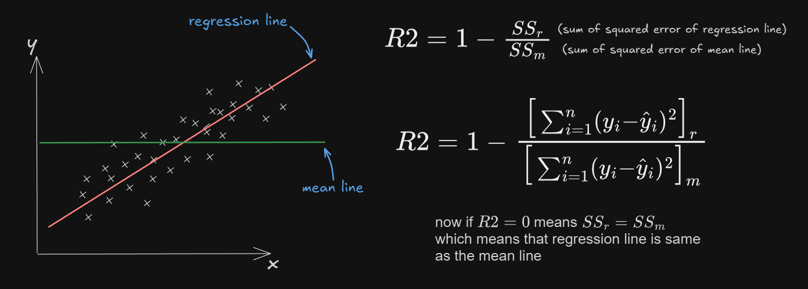  
  - Let say R2 score is 0.80, so we say R2 score is 80
  - This means - the input columns are able to explain 80% of variance in the output column
  - So if we had the ***cgpa***, ***package*** dataset then we can say cgpa is able to explain 80% of variance in package
  - If we had another column say ***iq*** then we would the 80% of variance in ***package*** is beign explained by ***cgpa*** and ***iq***
  - **But we have a problem in R2 score metric**
    - If you start adding more input columns then the R2 score will start increasing which is understandle. Like adding ***iq*** column
    - But the problem is - if you add any irrelevant column like ***temperature*** then it shouldn't actually have an impact on the output ***package*** column but its seen that the R2 score either increases or stays the same, which are both inappropriate behaviour. It should have decreased.
    - Here comes **Adjusted R2 Score**
  ### 5. Adjusted R2 Score
  - 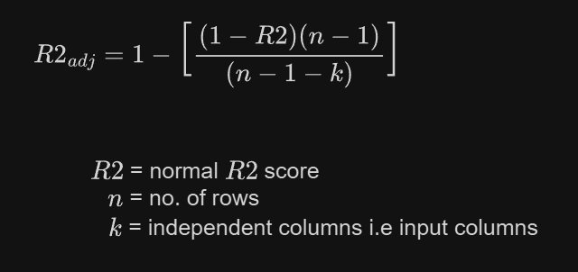  
  - So here when input columns increases i.e ***k*** increases.
  - This means the denominator ***(n - 1 - k)*** decreases.
  - And ***(n - 1)*** will remain constant
  - And ***R2*** will either stay the same or will decrease a little because of the irrelevant column. So we consider it didn't change
  - Now since the denominator decreased it means the overall fraction increased
  - Which then finally means ***adjusted R2*** decreased
  - Now everything is appropriate
  - If you add an irrelevant column then it decreases and if you add a relevant one then it increases as it should
   
  ## Multiple Linear Regression
  - Simple linear regression is used when there is single input output column
  - Multiple linear regression is used when there are multiple input columns in the dataset
  - Consider two input columns
    - ***cgpa*** and ***iq*** with ***package*** as output
    - Now as we drew a regression line in simple linear regression, here we construct a sheet that is at minimum distance from each point in the 3d space
  - In simple linear regression the formula was $\large y = mx + b$
  - Now y is not just depending on a single x right, so in multiple linear regression it is
    - $\large y = mx_1 + nx_2 + b$
    - or write $\large b = \beta_o \implies y = \beta_o + \beta_1x_1 + \beta_2x_2$
  - So the equation of plane is $\large y = \beta_o + \beta_1x_1 + \beta_2x_2$
  - So if there are $n$ input columns then equation of plane would be $\large y = \beta_o + \beta_1x_1 + \beta_2x_2 + \dotsb + \beta_nx_n$
   
  ## Gradient Descent
  - This is an optimization algorithm that is used to find the best values of m and b
  - 

  - In the above image you see we considered $\large m$ as constant and took only $\large b$ as a variable. Therefore in each iteration we were taking new values of $\large b$ with $\large b_{new} = b_{old} - \eta * slope$ where slope was calculated by differentiating the cost function ***with respect to $\large b$***
  - But if you take both $\large m$ and $\large b$ as variables, then in each iteration you will have to calculated new values for values for both $\large m$ and $\large b$ using $(\large b_{new} = b_{old} - \eta * slope)$ and $(\large m_{new} = m_{old} - \eta * slope)$ where the slope inside $b$ eqn is calculated by $\huge \frac{\partial L}{\partial b}$ and the slope inside $m$ eqn is calculated by $\huge \frac{\partial L}{\partial m}$.
  - $\huge \frac{\partial L}{\partial b} = -2 \sum_{i=1}^n(y_i - mx_i - b)(-1)$  
  - $\huge \frac{\partial L}{\partial m} = -2 \sum_{i=1}^n(y_i - mx_i - b)(-x_i)$
  - Here we are taking partial derivatives because there are two variables now $\large m$ and $\large b$
    
    ### Effect of learning rate $\large \eta$
  - 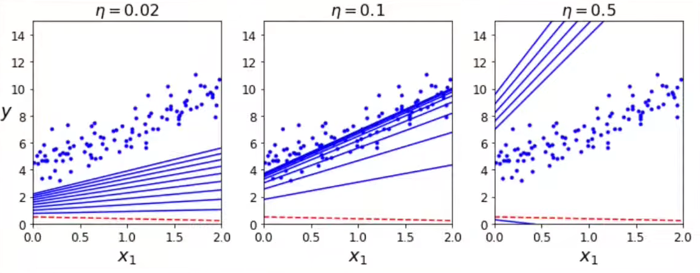  
   

    ### Effects of loss function itself
  - The cost function that we considered till now was looked nice like regular bowls.
  - 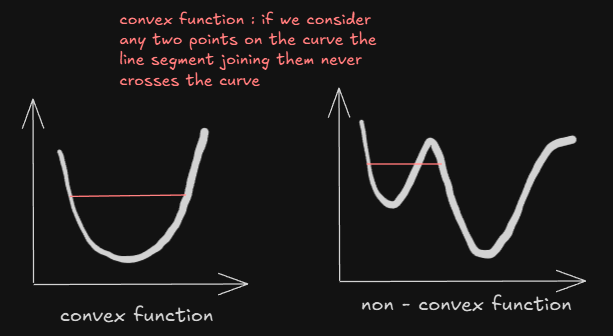 
  - But there may be problems like platues, ridges, etc that could make convergence to minimum difficult
  - 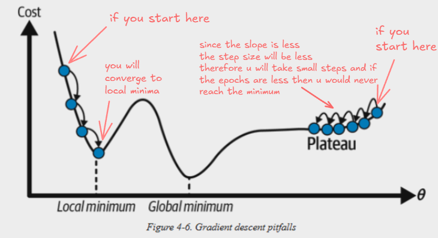  
   

    ### Effect of data on gradient descent
  - Feature scaling must be done before
  - If the features are scaled then the convergence will be faster
  - 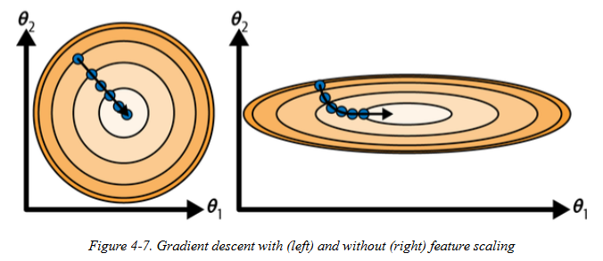  

    ### Types of gradient descent
    ### 1. <u>Batch gradient descent</u>
     - This the basic gradient descent
     - We use the entire dataset to calculate the update in each iteration
    ### 2. <u>Stochastic gradient descent</u>
     - Batch gradient descent was 1 update per epoch
     - Stochastic gd is $n$ updates ($n$ rows) per epoch
    ### 3. <u>Mini-batch gradient descent</u>
     - Here $n$ rows are made into batches. So epochs are per batch
     
  ## Polynomial Regression
  - 
     
  ## Bias/Variance trade off
  - 